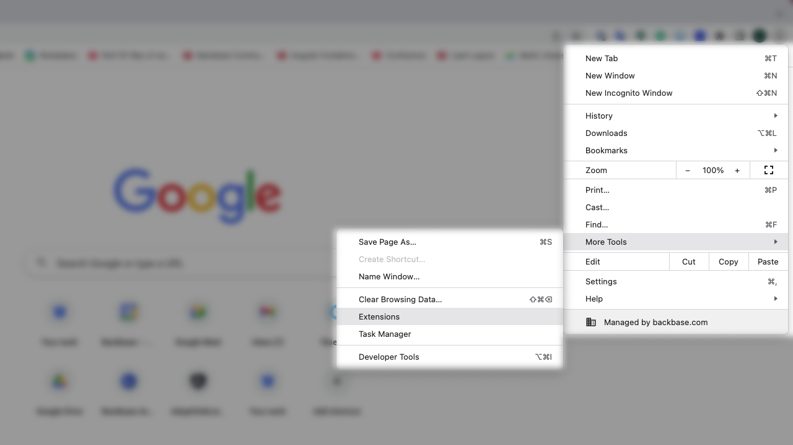
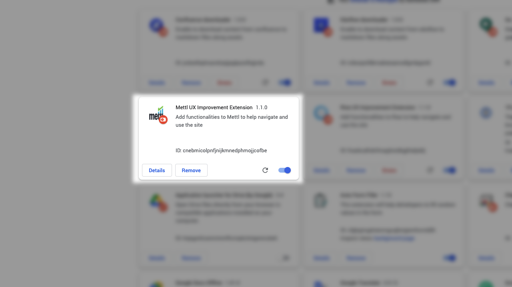

# Mettl UX Improvement

## Disclaimer

This extension will alter the normal behaviour of rise, use at your own risk. 

# Installation

## With git

```
mkdir -p ~/.chrome-extensions/ && cd ~/.chrome-extensions/ && git clone https://github.com/florianpasteur/mettl-ux-improvement.git
```


## Installation

From the menu, go to `More tools > Extensions` and activate the `Developer mode`




You're now able to load the extension, click on `Load unpacked` and select the location where you've unzipped the extension.


You should now see the extension in your list:




# Functionalities

Listed below the functionalities added by the extension
